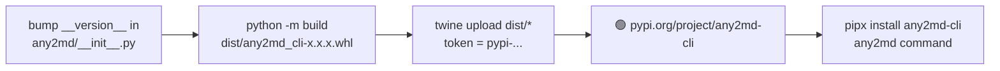

# Deploy Workflow

## Code → Production

```mermaid
flowchart TD
    A[Write code locally] --> B[git push origin main]

    B --> C[GitHub Actions CI\nci.yml]
    C --> D[ruff check .\nlint]
    C --> E[pytest -q\ntests on 3.11 + 3.12]
    D --> F{all green?}
    E --> F

    F -->|yes| G[Railway auto-redeploy\nvia GitHub integration]
    F -->|no| H[❌ fix + push again]

    G --> I[reads railway.toml\nbuilder = dockerfile]
    I --> J[builds Dockerfile\npython:3.11-slim\n+ ffmpeg + tesseract\n+ pip install '.[serve]']
    J --> K[container starts\nany2md serve --host 0.0.0.0\nreads $PORT from env]
    K --> L[🟢 Live\nhttps://any2md-production.up.railway.app]

    L --> M[GET /health → ok]
    L --> N[POST /convert → job id]
    L --> O[GET /jobs/id → status + download]
```

## PyPI Publish (manual, separate)



## Key Files

| File | Role |
|---|---|
| `.github/workflows/ci.yml` | runs ruff + pytest on every push |
| `railway.toml` | tells Railway to use Dockerfile; sets start command |
| `Dockerfile` | builds the production image |
| `pyproject.toml` | `name = "any2md-cli"` — the PyPI package name |
| `any2md/__init__.py` | `__version__` — bump before every PyPI release |

## Release Checklist

```
[ ] bump __version__ in any2md/__init__.py
[ ] git push → CI green
[ ] python -m build
[ ] twine upload dist/*
[ ] pipx install --force any2md-cli  (test it yourself)
```
